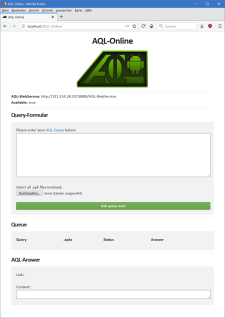

	 
	Online

# AQL-Online
The *Android App Analysis Query Language Online (AQL-Online)* is a website implementation which functions as a frontend for [AQL-WebServices](https://github.com/FoelliX/AQL-WebService).
[AQL-Queries](https://github.com/FoelliX/AQL-System/wiki/Questions) can be formulated and send to an AQL-WebService, which in return replies an [AQL-Answer](https://github.com/FoelliX/AQL-System/wiki/Answers), once its computation is done.
Once the answer is available the website offers textual and graphical result representations to take a view at it.

	

## Requirements
- In order to work properly any AQL-Online website instance must be configured to access a running [AQL-WebService](https://github.com/FoelliX/AQL-WebService),
- the host must support PHP,
- on the client side Javascript is required.

 

## Configuration
The AQL-Online website must be configured in order to be connected to an AQL-WebService.
The following parameters must be set up inside `config.php`:

| Parameter | Meaning |
| --------- | ------- |
| `$host = "192.168.0.1";` | The AQL-WebService host's ip. |
| `$port = "8080";` | The AQL-WebService's port it is listening on. |
| `$webservice = "http://".$host.":".$port."/AQL-WebService";` | Defines the complete domain of the webservice including subfolders. |
| `$interval = 10;` | By this parameter the polling-time in seconds can be specified. Once a query is issued the underlying AQL-WebServices is repeatedly polled to check if the requested answer is available. |

## License
The AQL-Online website is licensed under the *GNU General Public License v3* (see [LICENSE](https://github.com/FoelliX/AQL-Online/blob/master/LICENSE)).

## Contact
**Felix Pauck** (FoelliX)  
Paderborn University  
fpauck@mail.uni-paderborn.de  
[http://www.FelixPauck.de](http://www.FelixPauck.de)

## Links
AQL-Online can be used as a frontend...
- for AQL-WebServices: [https://github.com/FoelliX/AQL-WebService](https://github.com/FoelliX/AQL-WebService)
- in CoDiDroid: [https://github.com/FoelliX/CoDiDroid](https://github.com/FoelliX/CoDiDroid)